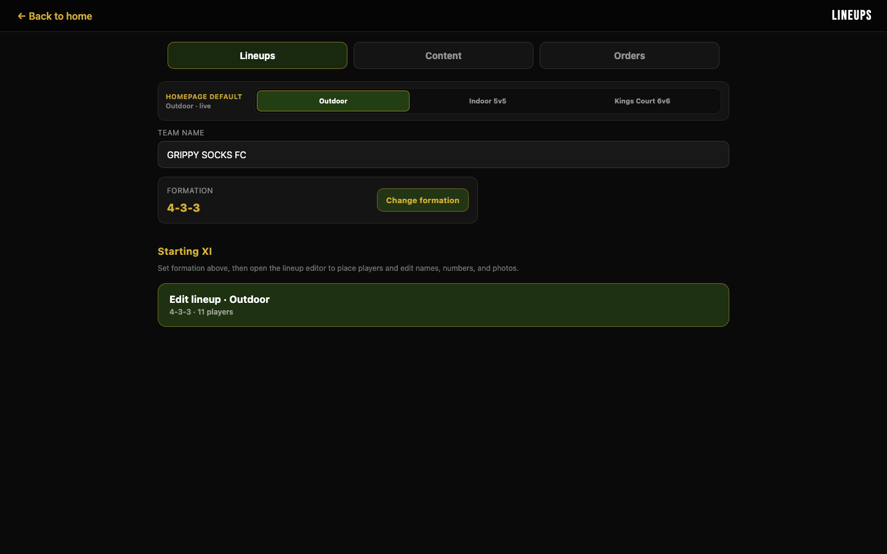
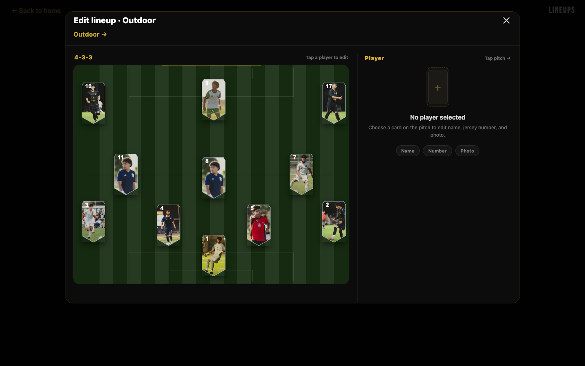
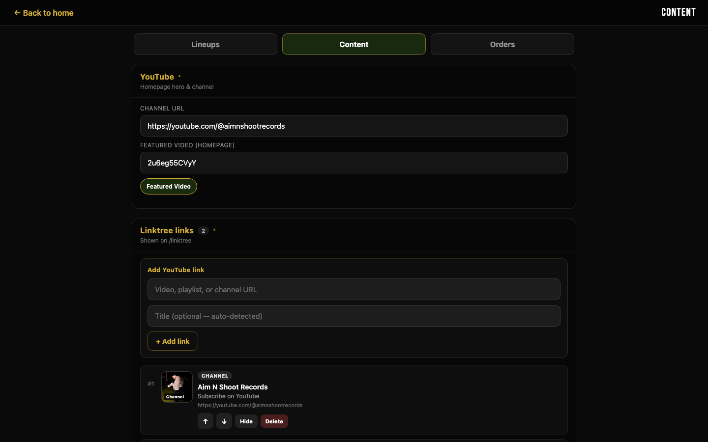
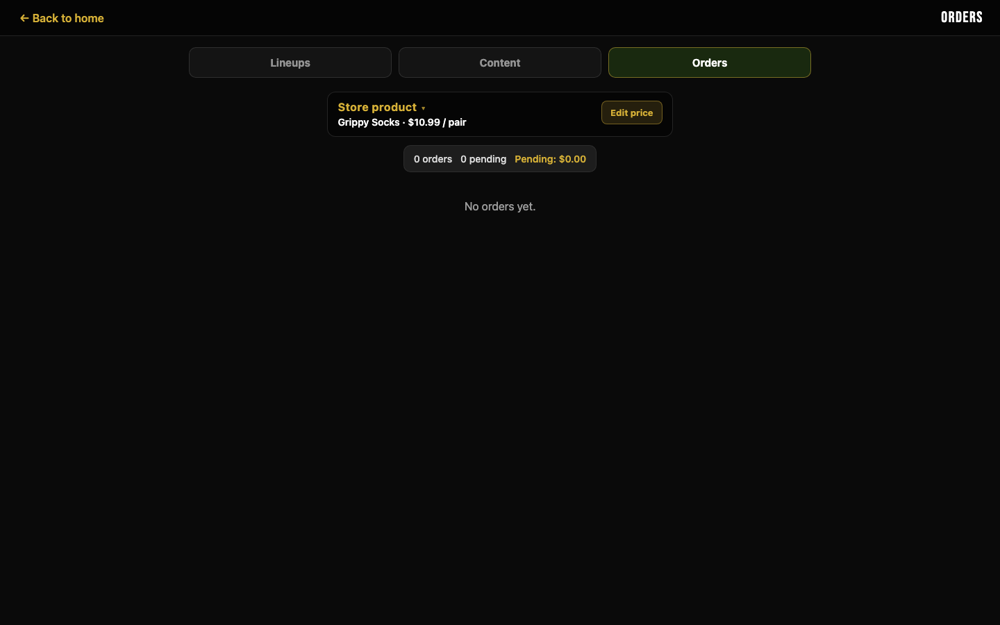
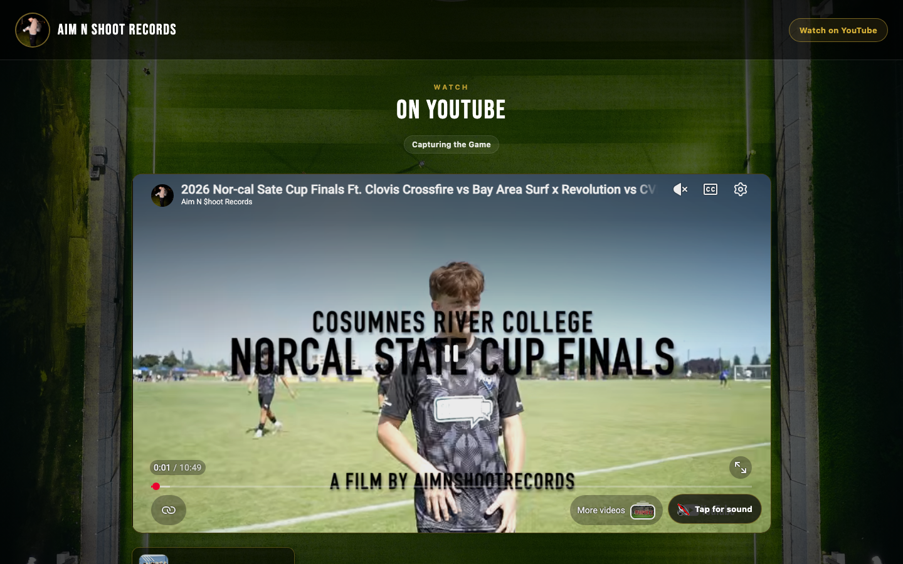
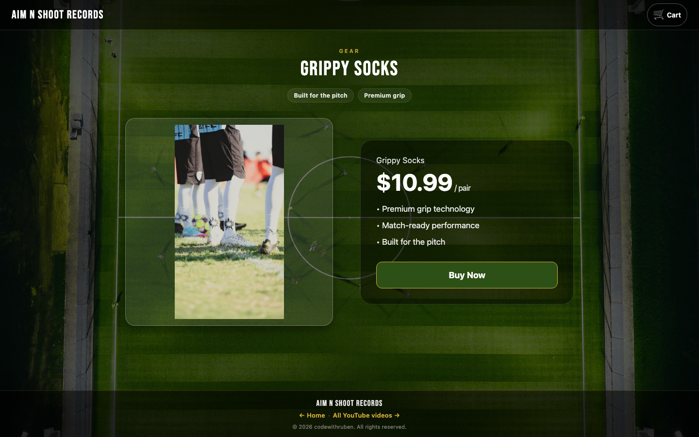
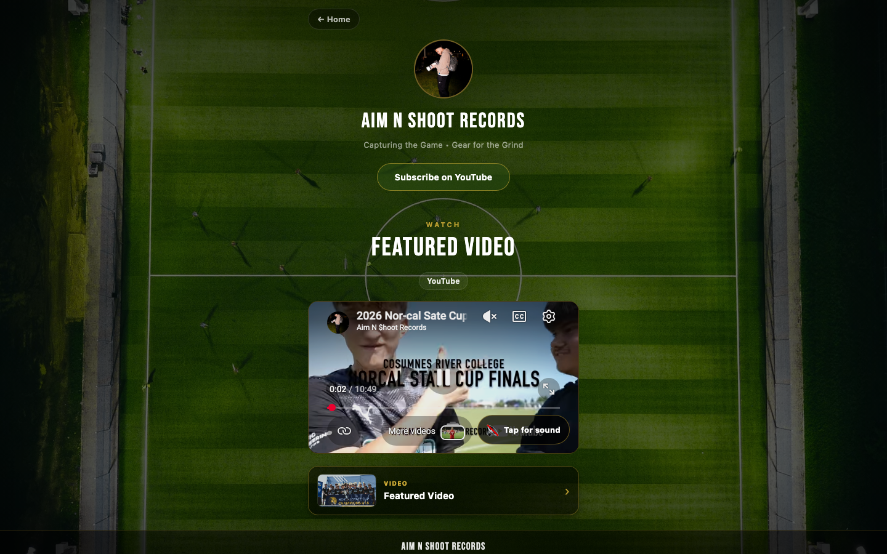
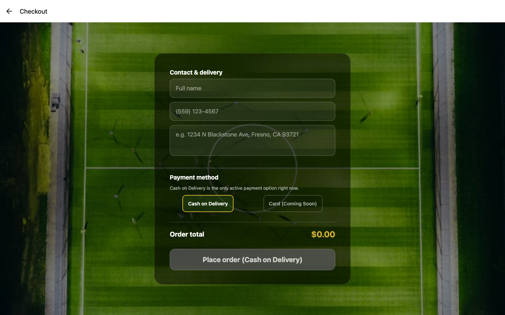

# GrippySocks Admin Guide

**Aim N Shoot Records** · Expo web app · Admin at `/admin`

All admin changes save to Firebase Realtime Database and take effect immediately on the live site.

---

## How to Access Admin

Navigate directly to `/admin` on your domain
There is no link to admin from the public site — it is URL-only.

---

## Site Structure

| Route | Page | What admin controls |
|---|---|---|
| `/` | Homepage | Featured YouTube video, Instagram carousel, team lineup |
| `/store` | Grippy Socks store | Product price (via Orders tab) |
| `/linktree` | YouTube link list | All links (via Content tab) |
| `/checkout` | Checkout form | — (customer-facing, no CMS) |
| `/admin` | Admin panel | Everything above |

---

## Admin Panel — Three Tabs

The admin panel has three equal-width tabs at the top: **Lineups**, **Content**, and **Orders**.

---

## Tab 1 — Lineups

Use this tab to control the team formation shown on the homepage and to edit every player on the pitch.

### Steps

**1. Choose the homepage mode**
Click **Outdoor**, **Indoor 5v5**, or **Kings Court 6v6**. The selected mode is the one visitors see on the homepage. The label beneath the selector shows which mode is currently live.

**2. Edit the team name**
Type directly in the **Team Name** field. This is shown as the lineup title on the homepage.

**3. Change the formation**
Click **Change formation** to open a formation picker with dot-preview layouts (4-3-3, 4-4-2, 3-5-2, etc.). Formation presets are saved per mode.

**4. Open the lineup editor**
Click **Edit lineup · Outdoor** (or the relevant mode button) to open the full-screen pitch editor.

---

### Lineup Editor

The editor shows the full pitch with all player cards positioned in the current formation.

**5. Tap a player card on the pitch**
The right-hand panel switches to that player. Fields appear for name, jersey number, and photo.

**6. Edit name and jersey number**
Type directly in the Name and Number fields. The card on the pitch previews the change in real time.

**7. Upload or import a player photo**
Three options:
- **Upload** — drag-and-drop or file-pick a photo (WebP/JPEG/PNG). Uploaded to Firebase Storage.
- **Instagram import** — paste an Instagram post URL to pull the player's photo automatically.
- **Stock images** — choose from the bundled player silhouette images.
- **Clear** — remove a custom photo and revert to the default placeholder.

**8. Switch between modes**
Tap **Outdoor →** at the top of the editor to jump to 5v5 or Kings Court without closing the overlay.

---

## Tab 2 — Content

Use this tab to manage the YouTube hero video, the Linktree page, and the Instagram carousel.

### YouTube section

**1. Channel URL**
Paste the full YouTube channel URL (e.g. `https://youtube.com/@aimnshootrecords`). Used for the "Watch on YouTube" button in the site header.

**2. Featured video (homepage hero)**
Paste the YouTube video ID (the string after `?v=`). Or click **Featured Video** to pick from your existing Linktree list.

---

### Linktree Links section

**3. Add a new YouTube link**
Paste a video, playlist, or channel URL into the Add YouTube link fields. The title is auto-detected from YouTube or you can type a custom one. Click **+ Add link**.

**4. Reorder links**
Use the **↑ ↓** arrows on each link card to change the display order on `/linktree`.

**5. Hide / Delete a link**
- **Hide** — keeps the link in the database but removes it from the page.
- **Delete** — permanently removes the link.

---

### Instagram section (below the fold)

**6. Add Instagram posts**
Paste Instagram post or reel URLs. Add an optional caption and custom thumbnail URL.

**7. Reorder / Hide / Delete**
Same controls as Linktree links.

**8. Save all content**
One **Save content** button pushes all three sections (YouTube, Linktree, Instagram) to Firebase atomically. The homepage and Linktree page update immediately.

---

## Tab 3 — Orders

Use this tab to monitor store orders in real time, update the product price, and receive browser push notifications.

### Product price

**1. Edit the product price**
Click **Edit price** next to _Grippy Socks · $X.XX_. Type the new price and confirm. The store page reflects the change instantly.

---

### Order management

**2. Read the summary bar**
Shows total orders placed, how many are pending, and total pending revenue. Updates live from Firebase — no page refresh needed.

**3. Review each order card**
Each order card shows:
- Date and time placed
- Payment method (Cash on Delivery or Stripe)
- Status pill: **Pending** or **Completed**
- Customer name and phone number
- Delivery address (tap to open in Maps)
- Line items (product, quantity, size)
- Order total

**4. Mark an order complete**
Tap **Mark completed** on any Pending order. Sets `status: completed` and `paid: true` in the database.

**5. Delete an order**
Tap **Delete** to permanently remove an order from the database. Use for test orders or cancelled cash pickups.

---

## Public Pages Reference

These pages are fully CMS-driven. Every admin save reflects here immediately.

### Homepage `/`

- YouTube hero video → controlled by Content tab (Featured video ID)
- Instagram carousel (below the fold) → controlled by Content tab (Instagram section)
- Team lineup section (below the fold) → controlled by Lineups tab

---

### Store `/store`

- Product price → controlled by Orders tab (Edit price)
- Product image is a static asset (`assets/images/grippysock2.jpg`)

---

### Linktree `/linktree`

- All video/channel links → controlled by Content tab (Linktree links)
- Featured video at the top → controlled by Content tab (Featured video)

---

### Checkout `/checkout`

Customer-facing only. On submit:
1. A new order document is written to `orders` in Firebase Realtime Database.
2. Cloud Functions fire a push notification to all registered admin subscriptions.
3. The order appears immediately in Admin → Orders tab.

---

## Quick Reference

| Task | Tab | Where |
|---|---|---|
| Change homepage video | Content | YouTube → Featured video |
| Add a YouTube video to Linktree | Content | Linktree links → + Add link |
| Add an Instagram post | Content | Instagram section → paste URL |
| Change team name | Lineups | Team Name field |
| Switch formation (4-3-3 → 4-4-2) | Lineups | Change formation button |
| Edit a player name / number | Lineups | Edit lineup → tap card → Name/Number |
| Upload a player photo | Lineups | Edit lineup → tap card → Upload |
| Update product price | Orders | Edit price |
| Mark an order complete | Orders | Order card → Mark completed |
| Get push notifications for new orders | Orders | Enable order notifications |

---

*Generated from live screenshots · GrippySocks · Aim N Shoot Records · 2026*
