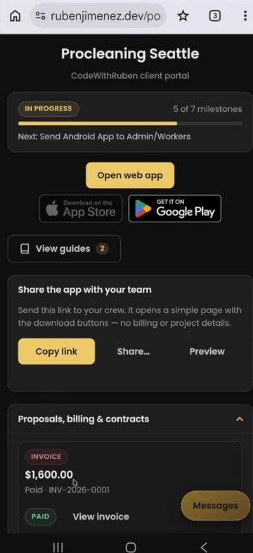
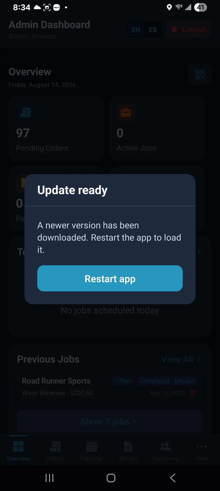
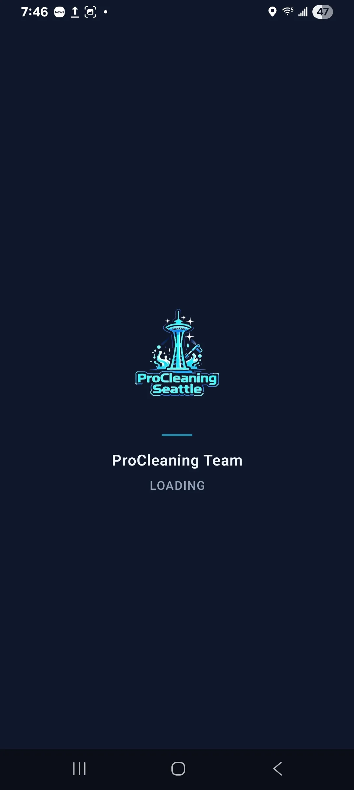
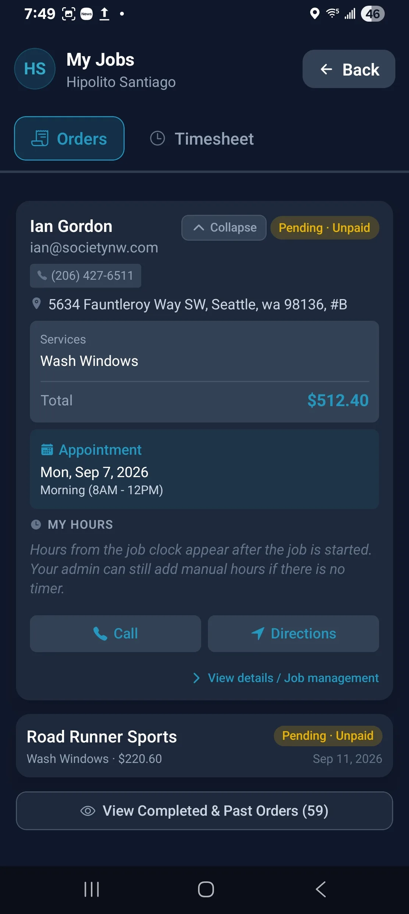
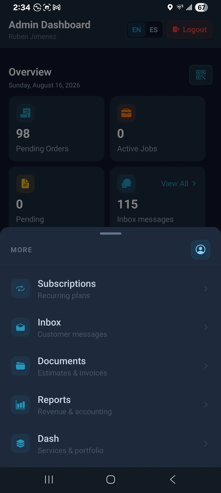
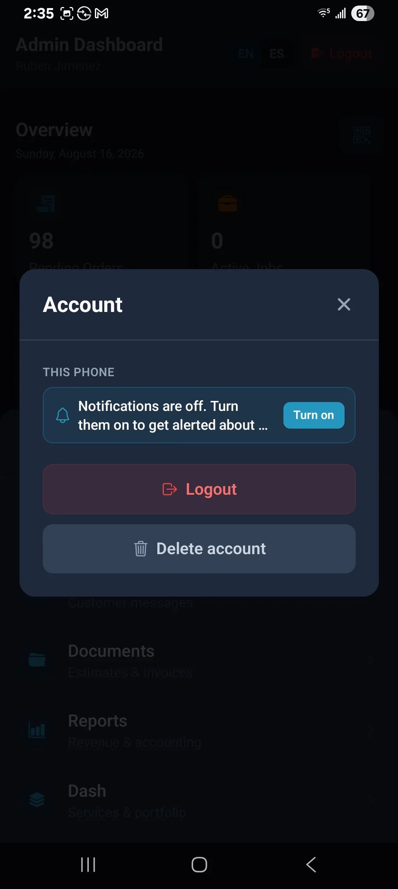

# ProCleaning Team — Android access

Staff app for admins and workers. Customers use **procleaningseattle.com**, not this app.

Admins land on **Overview**. Workers land on **My Jobs**.

---

## Install (Android)

Play will not find this app in a normal search. Use the **same Gmail** on the phone’s Play Store for these two steps. App sign-in (Google / Microsoft) can be a different company account.

**1.** Owner adds that Gmail as a tester, then open:

**[Become a tester](https://play.google.com/apps/testing/com.procleaning.app)**

**2.** On the phone, install:

**[ProCleaning Team on Google Play](https://play.google.com/store/apps/details?id=com.procleaning.app)**

---

## First open

If you see **Update ready**, tap **Restart app**.

Sign in with **Google** or **Microsoft**.

You’ll see **Signed in**, then **Loading…**. That is normal.

Allow **notifications**, then **Tap to Pay**, when the phone asks.

---

## After sign-in

**Admin**

**Worker**

---

## Notifications later

**More** → person icon → **Account**. Enable notifications lives here. (Workers: tap your name → Account.)

| More | Account |
| --- | --- |
|  |  |

---

## Related

- [Tap to Pay](./tap-to-pay-guide.md)
- [App walkthrough](./admin-app-walkthrough.md)
