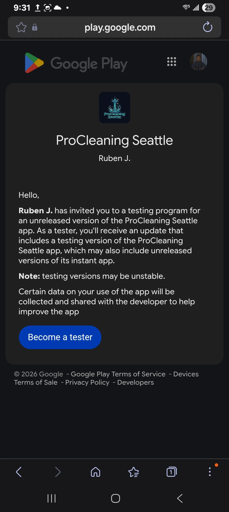

# ProCleaning Team — Android Access Guide

**ProCleaning Seattle** · Staff app on Google Play (Closed testing) · Admins & field workers

This guide is for day-to-day use of the **ProCleaning Team** Android app. It is **not** the public website customers use to book or request quotes.

---

## What this app is

| App | Who uses it | Purpose |
|---|---|---|
| **ProCleaning Team** (Android / iOS) | Admins & workers | Jobs, inbox, schedule, Tap to Pay, CMS tools |
| **procleaningseattle.com** (website) | Customers | Marketing, quotes, booking, checkout |

Staff sign in with a company Google or Microsoft account (or an approved email login when provided). After sign-in:

- **Admins** land on **Overview**
- **Workers** land on **My Jobs**

---

## How to get the app (Android)

The official live build is distributed on **Google Play Closed testing** (not the public Play Store search).

### Steps

**1. Get invited**  
An owner adds your Google account to the Closed testing list (or shares the Closed testing opt-in link).

**2. Open the opt-in / Play link**  
Use the invite link on the same Google account that will install the app. Accept Closed testing if Play asks.

**3. Install ProCleaning Team**  
Install from Play like any other app. Updates can arrive from Play (new binary) or silently as in-app updates (see Restart below).

> **Owner note:** Keep the real Closed testing URL in your password manager / hub notes. Replace this placeholder when you paste the live link into staff onboarding messages.

---

## First open & updates

**1. Open the app**  
You may briefly see the ProCleaning brand screen while the app loads.

**2. If you see “Update ready”**  
Tap **Restart app**. That applies the latest in-app update (fixes and improvements without waiting for a new Play install).

**3. Sign in**  
Use **Google** or **Microsoft**. Use email/password only if an owner gave you a demo or review login.

**4. Wait through “Successfully signed in” → “Loading…”**  
The app stays on the brand loading screen until Overview or My Jobs data is ready. That is normal.

---

## After sign-in — who sees what

### Admin

You see **Admin Dashboard** with a bottom tab bar (Overview, Orders, Calendar, Quotes, Customers, More, …).

### Worker

You see **My Jobs** with tabs for jobs and timesheet. No full admin CMS.

---

## Enable notifications (recommended)

Push alerts are how you hear about new messages, jobs, quotes, and payments on the phone.

### Admin

**1.** Open **Inbox** (Messages) — under **More** if it is not on the main tab bar.  
**2.** Tap **Enable notifications** and allow permission when Android asks.

### Worker

**1.** Open **Account** (tap your name / avatar at the top).  
**2.** Tap **Enable notifications** and allow permission.

### What you may get notified about

| Role | Typical push alerts |
|---|---|
| **Admin** | New customer message, new quote, new estimate from quote, new booking, job completed, payment received, price-mismatch scan results |
| **Worker** | Newly assigned job; Tap to Pay announcement when first enabled on that account |

---

## Language & account

- **EN / ES** — language toggle in the admin header (and worker account area).
- **Logout** — signs you out of this device.
- **Delete account** — removes *your* staff login access. Job and customer records stay with the business. Only use if an owner directed you to.

---

## Daily habits

1. Open the app at the start of the day (or after a long time closed) so updates and notifications stay current.  
2. If something looks “stuck” or missing a recent fix, force-close the app and reopen (or tap **Restart** if Update ready appears).  
3. Keep notifications enabled on the phone you carry on jobs.  
4. Workers: confirm you are assigned on the job before starting; use Manage Job for clock / notes / payment as trained.

---

## Troubleshooting

| Symptom | What to try |
|---|---|
| **OAuth setup needed** | App build is missing sign-in config. Ask the owner for a newer Play build / update, then restart. |
| Can’t install from Play | Confirm you’re on the invited Google account and accepted Closed testing. |
| Signed in but empty screen for a while | Wait for Loading to finish; check network. |
| No push notifications | Re-open Enable notifications; check Android app notification settings; confirm you granted permission. |
| Old UI after an update was announced | Force-close → reopen, or Restart when prompted. |
| Expo Go / simulator | Staff push and Tap to Pay need a real installed Play/App Store (or EAS) build on a physical device. |

---

## Related guides

- [Tap to Pay guide](./tap-to-pay-guide.md) — taking contactless payments on Android & iOS  
- [App walkthrough](./admin-app-walkthrough.md) — public site, admin tabs, and worker screens
