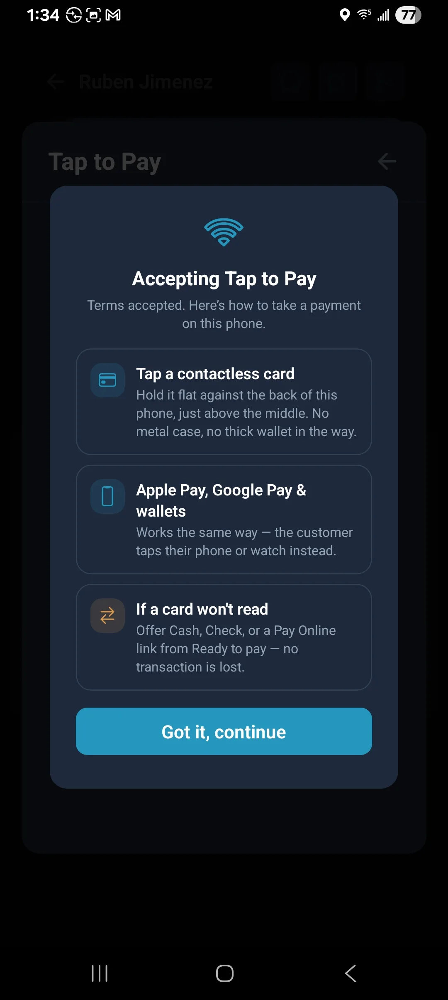
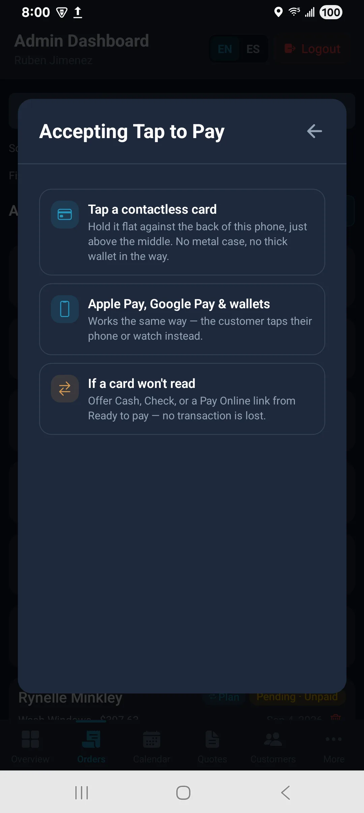
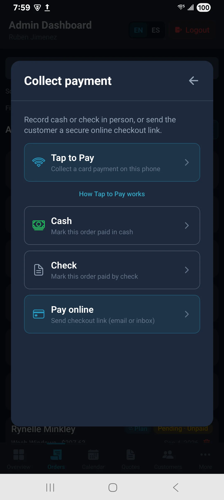

# ProCleaning Team — Tap to Pay

Collect a card or wallet on a staff phone. No separate reader. Staff app only — not the website.

After sign-in the app asks **notifications**, then **Tap to Pay**. Allow the sheets. Admins and workers both do this on their own phone. You do not need Account → Enable.

---

## First time

You may see a short intro. Continue when ready.

Before the first collection, a short how-to may appear. Continue.

Missed a sheet? **More** → person icon → **Account** → Enable. (Workers: tap your name.)

| More | Account |
| --- | --- |
|  |  |

---

## Take a payment

Open the job → **Manage Job** → Tap to Pay. Hold the phone still. Customer taps the back.

Wait for success. The order updates. If it fails, retry once, then Pay Now, cash, or check.

What to say: “Card on this phone — tap here when it says ready.”

NFC on, thick case off. Needs a real staff install on a supported phone.

---

## Related

- [Android access](./android-access-guide.md)
- [App walkthrough](./admin-app-walkthrough.md)
