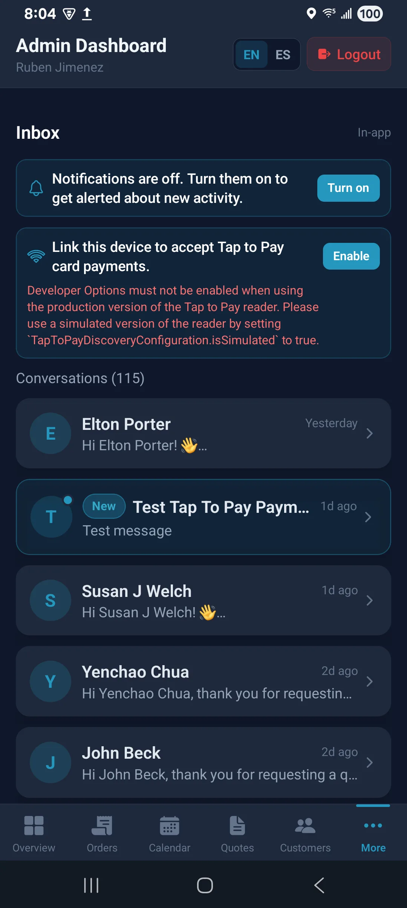

# ProCleaning Team — Tap to Pay Guide

**ProCleaning Seattle** · Staff app (Android & iOS) · Stripe Tap to Pay

Use this guide when collecting **contactless card / wallet** payments on a phone in the field — no separate card reader required.

---

## What Tap to Pay is

Tap to Pay turns a supported staff phone into a contactless terminal. The customer holds their card, Apple Pay, Google Wallet, or similar near the phone. Payment runs through Stripe and ties to the job/order in ProCleaning Team.

It is available in the **staff app only** (not the public website checkout). Online Pay Now links and cash/check recording remain available as fallbacks.

---

## Requirements

| Requirement | Notes |
|---|---|
| **Supported phone** | Modern Android or iPhone with NFC; Tap to Pay–capable model |
| **Staff app installed** | ProCleaning Team from Play Closed testing / App Store build — not Expo Go |
| **Signed in** | Admin or worker account |
| **Tap to Pay enabled on this device** | Asked automatically after sign-in (notifications first, then Tap to Pay). Accept the OS/Stripe terms when they appear. You do **not** need to open Account and tap Enable. |
| **Job / order context** | Usually started from **Manage Job** on a real order |

---

## First-time setup on a device

### 1. Sign in

Open ProCleaning Team and sign in as admin or worker.

### 2. Allow the post–sign-in prompts

Right after the first successful sign-in on this install, the app asks on this phone — **notifications first**, then **Tap to Pay**. You do **not** need to open Account or tap **Enable**.

When Tap to Pay starts, accept:

- Location (required by card networks)  
- Bluetooth on Android 12+ if asked  
- **Apple / Google / Stripe** Tap to Pay terms on this device  

Admins and workers both get this sequence. Each phone is linked as a reader on its own — workers do not wait for an admin to enable Tap to Pay first. This does **not** collect a payment.

If you already allowed notifications on an earlier update, you may only see the Tap to Pay sheets this time.

### 3. Read the Tap to Pay intro (if shown)

You may see a **hero** explaining Tap to Pay. Dismiss / continue when ready — that can also trigger a one-time announcement notification.

### 4. If the sheets were missed or denied

**Enable Tap to Pay** remains under **Account** (this phone) as a backup:

- **Admins:** **More** → Account icon  
- **Workers:** tap your name / avatar → **Account**

Tap **Enable** only if collect-card still asks you to turn Tap to Pay on, or after a reinstall.

### 5. Education screens

Before collecting, the app may show short **education** cards (what Tap to Pay is, wallets, fallback). Read once, then continue.

---

## Collecting a payment (day to day)

**1. Open the job**  
Admin: **Orders** (or Overview) → open the order → **Manage Job**.  
Worker: **My Jobs** → open the assigned job → manage / pay actions as trained.

**2. Choose Tap to Pay / collect card**  
Select the on-device contactless option (wording may be “Tap to Pay” or similar in Manage Job).

**3. Hold for the customer**  
When the waiting screen appears, hold the phone steady. Ask the customer to tap their card or wallet on the back/top of the phone (follow on-screen hints).

**4. Confirm success**  
Wait for success in the app. The order should show payment received. Admins may also get a push: payment received.

**5. If it fails**  
Retry once with a steady hold and NFC on. If it still fails, use a **Pay Now link**, inbox nudge, or record **cash/check** in Manage Job per shop policy.

---

## Customer experience (what to say)

Keep it simple:

1. “I’ll take card on this phone — no reader.”  
2. “Tap your card or phone here when the screen says ready.”  
3. “You’re all set” when the app confirms.

Do not ask them to open the ProCleaning website for Tap to Pay — that path is for online checkout links only.

---

## Android vs iPhone notes

| | Android | iPhone |
|---|---|---|
| Install | Play Closed testing build | App Store / TestFlight staff build |
| Enable | After sign-in: Google / Stripe sheets (Account → Enable only if missed) | After sign-in: Apple Tap to Pay terms sheet (Account → Enable only if missed) |
| NFC | Must be on; case/metal can block taps | Same — clear the back of the phone |
| Iconography | Follow in-app prompts | Apple requires specific Tap to Pay visuals in-app (already built in) |

---

## Fallbacks when Tap to Pay isn’t available

- **Pay Now / checkout link** — email or inbox to the customer  
- **Cash or check** — record in Manage Job  
- **Retry later** — if NFC is blocked, or finish the post–sign-in Tap to Pay sheets / Account → Enable if they were denied  

---

## Troubleshooting

| Symptom | What to try |
|---|---|
| No Tap to Pay prompt after sign-in | Wait until the dashboard/jobs screen appears; allow notifications first if asked; confirm a real staff build (not Expo Go) |
| Still asked to enable | **More → Account** (admin) or **Account** (worker) → **Enable**; finish OS terms |
| Enable / connect fails | Stable internet; finish OS terms; try Account → Enable after force-close |
| Waiting forever | Customer NFC payment method; remove thick case; hold still; NFC on |
| “Not supported” | Device may not support Tap to Pay — use link or cash/check |
| Payment took but order looks unpaid | Pull to refresh / reopen order; ask admin to verify in Orders |

---

## Related guides

- [Android access guide](./android-access-guide.md) — install, sign-in, notifications  
- [App walkthrough](./admin-app-walkthrough.md) — where Manage Job and Inbox live in the app
