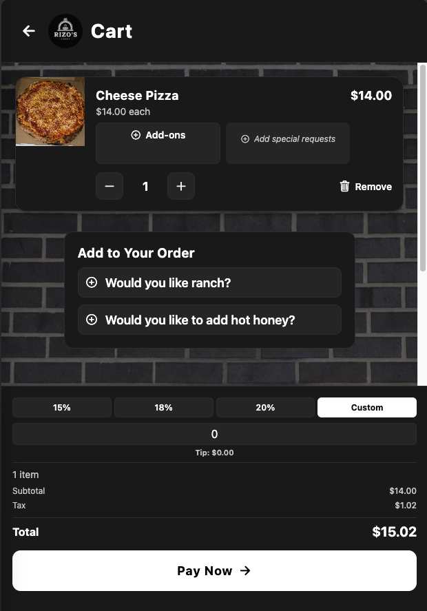
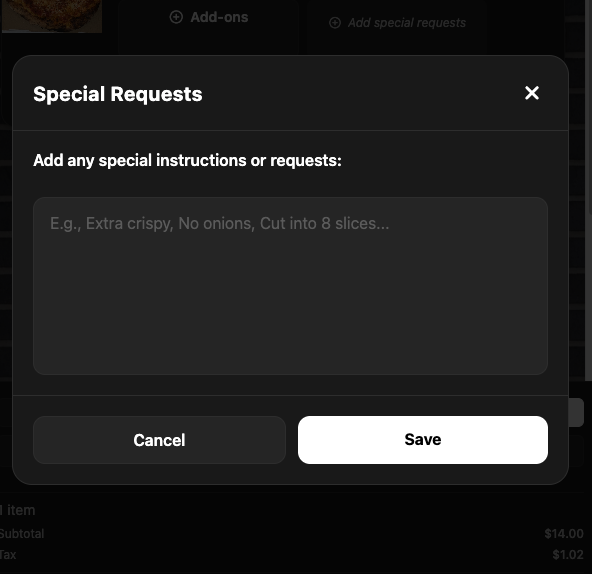

# Rizo Pizza — New Features Guide

*Updated May 2026 · live app screenshots*

---

## Note from Ruben

I wasn't able to offer payment right now, but I built these improvements instead so ordering and running the pop-up is easier for you and your customers.

---

## How to use this guide

| | |
|---|---|
| **Customers** | Home → Menu → Cart → tip → Pay Now |
| **Staff** | Gear icon → login → dashboard |
| **Banners** | Event: home + menu · GoFundMe: home + cart |

---

## Step-by-step (current app screens)

### Step 1 — Home page

What customers see on first load: open/closed banner at the very top, logo + gear icon, announcements, avg prep, and View Menu & Order.

---

### Step 2 — Menu + pop-up event

Menu header with cart, status banner, compact upcoming event banner, and category filters — then menu items below.

---

### Step 3 — Cook login + orders today

Tap the gear on home. Orders today shows here for staff only — removed from the public home page.

---

### Step 4 — Cart + tipping

GoFundMe banner at top (no pop-up banner in cart). Pick 15%, 18%, 20%, or Custom before Pay Now. Tip is charged via Square and shown on cook order cards.

---

### Step 5 — Special requests

Per pizza: Add special requests opens a modal. Notes appear on the cart item and on your order in the cook dashboard.

---

### Step 6 — Checkout button states

Select Tip to Continue until a tip is chosen. Currently Closed when not accepting orders. Disabled labels use light gray text for readability.

| State | When | Button label |
|-------|------|----------------|
| Tip required | Cart has items, no tip selected | **Select Tip to Continue** (light gray on dark button) |
| Closed | Store is not accepting orders | **Currently Closed** (light gray on dark button) |
| Ready to pay | Tip selected and store is open | **Pay Now →** (black on white button) |

---

### Step 7 — Cook dashboard

Manage Announcements for pop-up + GoFundMe. Each order card shows subtotal, tax, tip, and total.

**Manage Announcements**

- **Pop-up Event** (on/off) — Title, location, date, time, description, links
- **GoFundMe** (on/off) — Title, description, donate URL
- **Order totals** — Subtotal · Tax · Tip · Total on each active order

**Quick steps**

1. Gear on home → password
2. Manage Announcements → Save
3. Toggle event or GoFundMe anytime
4. Orders show tip in the total
