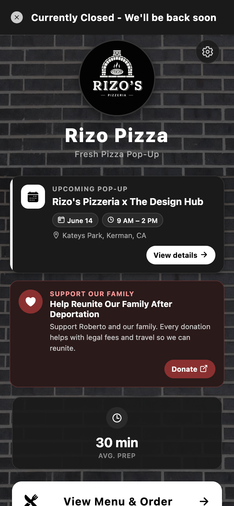
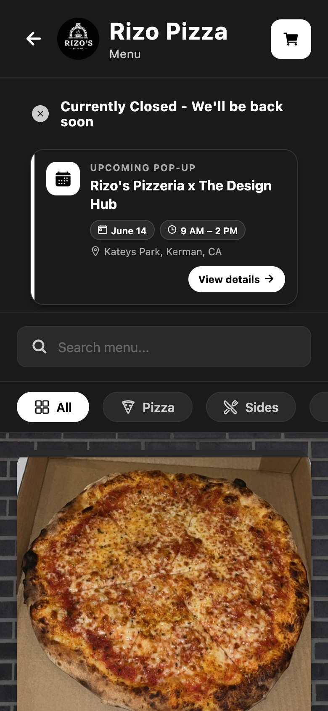
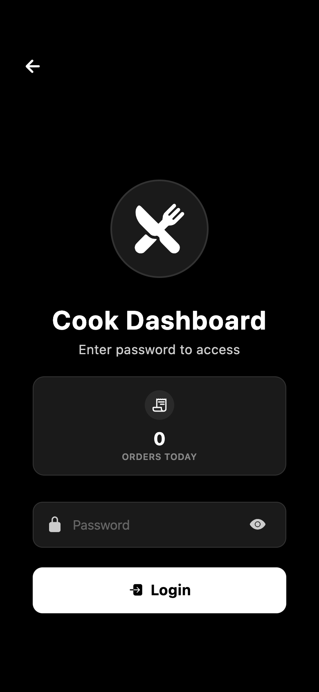
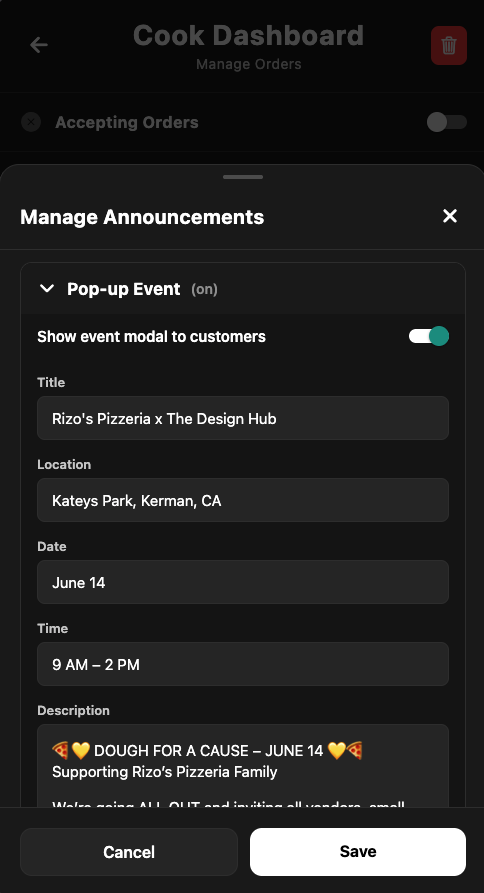

# Rizo Pizza — New Features Guide

*Updated May 2026 · live app screenshots*

---

## Note from Ruben

I wasn't able to offer payment right now, but I built these improvements instead so ordering and running the pop-up is easier for you and your customers.

---

## How to use this guide

| | |
|---|---|
| **Customers** | Home → Menu → Cart → tip → Pay Now |
| **Staff** | Gear icon → login → dashboard |
| **Banners** | Event: home + menu · GoFundMe: home + cart |

---

## Step-by-step (current app screens)

### Step 1 — Home page

What customers see on first load: open/closed banner at the very top, logo + gear icon, announcements, avg prep, and View Menu & Order.

---

### Step 2 — Menu + pop-up event

Menu header with cart, status banner, compact upcoming event banner, and category filters — then menu items below.

---

### Step 3 — Cook login + orders today

Tap the gear on home. Orders today shows here for staff only — removed from the public home page.

---

### Step 4 — Cook dashboard

Manage Announcements for pop-up + GoFundMe.

---

**Manage Announcements**

---
- **Pop-up Event** (on/off) — Title, location, date, time, description, links
- **GoFundMe** (on/off) — Title, description, donate URL

**Quick steps**

---
1. Gear on home → password
2. Manage Announcements → Save
3. Toggle event or GoFundMe anytime
